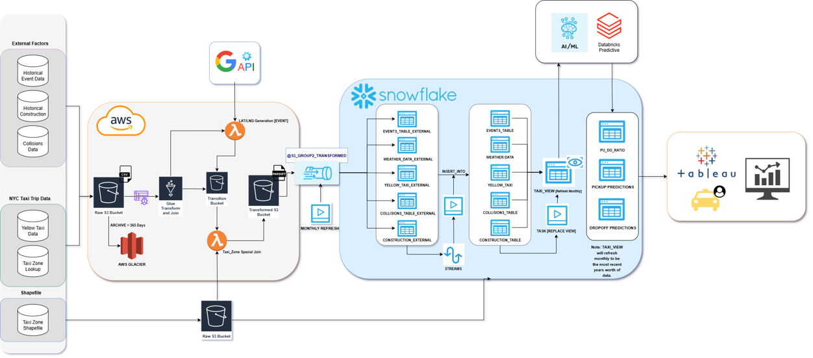

# TechCatalyst-Capstone-Taxi-Project

This project uses the below datasets filtered to 2024:
- [Street Construction Permits](https://data.cityofnewyork.us/Transportation/Street-Construction-Permits-2022-Present-/tqtj-sjs8/about_data)
- [Taxi Zones](https://www.nyc.gov/site/tlc/about/tlc-trip-record-data.page)
- [Yellow Taxi Trip Data 2024](https://www.nyc.gov/site/tlc/about/tlc-trip-record-data.page)
- [National Centers for Environmental Information: National Oceanic and Atmospheric Administration - NY CITY CENTRAL PARK](https://www.ncdc.noaa.gov/cdo-web/datasets/GHCND/stations/GHCND:USW00094728/detail)
- [New York City Historical Events](https://data.cityofnewyork.us/City-Government/NYC-Permitted-Event-Information-Historical/bkfu-528j/about_data)
- [Motor Vehicle Collisions: Crashes](https://data.cityofnewyork.us/Public-Safety/Motor-Vehicle-Collisions-Crashes/h9gi-nx95)
- [Motor Vehicle Collisions: Person](https://data.cityofnewyork.us/Public-Safety/Motor-Vehicle-Collisions-Person/f55k-p6yu)
- [Motor Vehicle Collisions: Vehicles](https://data.cityofnewyork.us/Public-Safety/Motor-Vehicle-Collisions-Vehicles/bm4k-52h4)

This project uses the below technologies:
AWS S3 (Storage)
AWS Glue (Data Preprocessing, Cleaning, and Preparation)
Snowflake (Data Warehouse and SQL Insights)
Databricks (Machine Learning Insights)
Tableau (Analytics and Dashboarding)

Data is stored in Raw Amazon S3 Bucket.

Data is crawled, processed, and sent to Transformed Amazon S3 Bucket as parquet files.

Data is exported to snowflake, for SQL analytics. Data is joined and converted into a data analytic view.

The Taxi View data is imported into Tableau for visualizations and additional insights. 

The Taxi View data is imported into databricks for machine learning analysis using PyCaret and Prophet. (Python 3.11)
